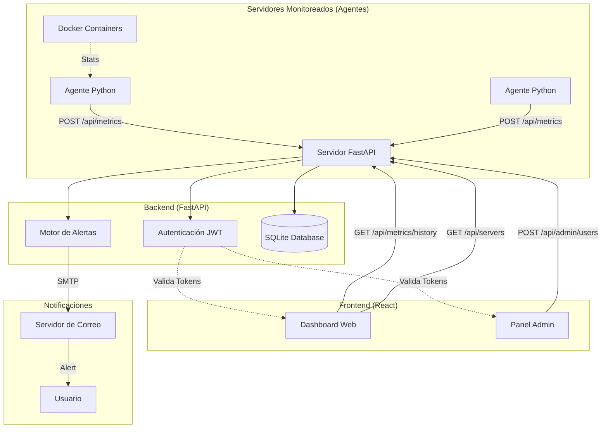

# Arquitectura del Sistema Monitor Integral

Este documento describe la arquitectura del sistema de monitoreo de servidores ServPulse.

## Diagrama de Flujo de Datos

## Componentes Principales

### 1. Agente (Agent)
- Script en Python que se ejecuta en cada servidor monitoreado.
- Recopila métricas de CPU, RAM, Disco y Red.
- Envía datos periódicamente al servidor central vía HTTP POST.

### 2. Backend (Server)
- Construido con **FastAPI**.
- Maneja la ingestión de métricas, autenticación de usuarios y lógica de negocios.
- **Base de Datos**: SQLite (usando SQLAlchemy) para almacenar usuarios, configuración de servidores, historial de métricas y reglas de alertas.
  - Funciona en modo **WAL** (`journal_mode=WAL`, `synchronous=NORMAL`) para permitir lecturas del dashboard concurrentes con las escrituras de los agentes, más un `busy_timeout` de 30 s para evitar errores de "database is locked".
  - Índice compuesto `ix_metrics_server_id_id` para resolver de forma eficiente la consulta "última métrica por servidor".
- **Caché en memoria**: las métricas recientes, los umbrales y el estado de cooldown de alertas viven en diccionarios a nivel de módulo. Por eso el backend corre con **un solo worker** de Gunicorn (`run_prod.sh`); con varios workers la caché y la deduplicación de alertas no se comparten entre procesos.
- **Motor de Alertas**: Verifica umbrales (Thresholds) cada vez que llegan métricas y envía correos si se superan.

### 3. Frontend (Dashboard)
- Aplicación de una sola página (SPA) construida con **React** (sin build step complejo, servido estáticamente).
- Permite visualizar métricas en tiempo real, gestionar usuarios (admin) y configurar reglas de alerta.
- Utiliza **Chart.js** para gráficos históricos.

### 4. Seguridad
- Autenticación basada en **JWT** (JSON Web Tokens).
- Los agentes se autentican implícitamente por ID de servidor (modelo de confianza simple por ahora, se recomienda VPN/Firewall).
- Los usuarios tienen roles (Admin/User) que restringen el acceso a ciertas funcionalidades.
